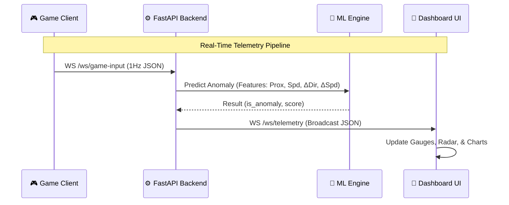

# <p align="center">🛸 NEXUS — High-Fidelity Robot Telemetry & ML Dashboard</p>

<p align="center">
  
  
  
  
</p>

<p align="center">
  <strong>NEXUS is an end-to-end telemetry ecosystem designed to simulate, monitor, and analyze autonomous robot behavior in real-time. It features an interactive 2D physics sandbox, a FastAPI-driven data pipeline, and a sci-fi themed command center powered by unsupervised machine learning.</strong>
</p>

---

## 🎯 Core Objectives & Achievements

This project successfully implements the following production-grade requirements:

- **🛰️ High-Fidelity Simulation**: Real-time generation of robot sensor data (proximity, speed, and heading) using Python with added Gaussian noise for realism.
- **📊 Live Telemetry Dashboard**: A high-performance web interface built with **FastAPI** and **WebSockets** for instantaneous data visualization.
- **🧠 ML Anomaly Detection**: Integrated **scikit-learn (Isolation Forest)** pipeline for unsupervised real-time anomaly detection on incoming data streams.
- **☁️ Cloud-Native Deployment**: Fully containerized using **Docker** and deployed to **Google Cloud Platform (GCP)** via Cloud Run.
- **🗺️ Path Visualization**: (Bonus) An interactive 2D canvas that visualizes the robot's historical path, current heading, and simulated obstacles.

---

## 🦾 Robotics Concepts Applied

NEXUS serves as a practical implementation of several foundational academic and industrial robotics concepts:

*   **Kinematics & Odometry**: Implements a **Non-Holonomic Drive Model**. The system estimates the robot's global position $(X, Y)$ and heading $(\theta)$ over time using Euler integration based on linear and angular velocity.
*   **Sensor Raycasting**: Simulates physical hardware like LiDAR or Ultrasonic sensors by mathematically casting rays from the robot's origin against geometric obstacles to calculate proximity.
*   **Noise Modeling**: Real hardware is never perfect. The simulation injects **Gaussian Noise (Jitter)** into the raw sensor streams to mimic the inaccuracies of physical environments.
*   **Signal Processing**: Implements edge-level **Simple Moving Average (SMA)** filters to smooth out 1-tick hardware spikes and prevent false-positive anomaly detections.
*   **Telemetry & IoT Architectures**: Demonstrates how to decouple physical edge devices (robots) from heavy cloud processing using asynchronous, high-frequency JSON payload streaming over WebSockets.

---

## 🌐 Live Infrastructure (DISABLED FOR NOW, TRY THE LOCAL DEVELOPMENT)

| Service | Environment | Access URL |
| :--- | :--- | :--- |
| **Command Center** | Google Cloud Run | [https://nexus-dashboard-1006160179252.us-central1.run.app](https://nexus-dashboard-1006160179252.us-central1.run.app) |
| **Remote Game Controller** | Google Cloud Run | [https://nexus-dashboard-1006160179252.us-central1.run.app/game/](https://nexus-dashboard-1006160179252.us-central1.run.app/game/) |

---

## 🏗️ System Architecture

NEXUS utilizes a **Reactive Streaming Architecture** where data flows from the edge (simulator or interactive game) to the core (ML engine) and finally to the dashboard with sub-50ms processing latency.



### Technical Component Breakdown

1.  **Simulation Layer (`/simulator`)**:
    *   Implements a discrete-time kinematic model for the robot.
    *   Generates Gaussian-noisy sensor data to simulate real-world hardware jitter.
    *   Features a deterministic anomaly injector for testing ML recall.

2.  **ML Inference Engine (`/backend/ml`)**:
    *   Uses **Isolation Forest**, an unsupervised anomaly detection algorithm.
    *   Feature Engineering: Instead of raw coordinates, the model uses **Speed Delta** and **Heading Delta** to detect erratic jerky movements or sudden collisions.
    *   **Warm-up Period**: Automatically baselines "normal" behavior during the first 20 readings before enabling live alerts.

3.  **Real-Time Command Center UI (`/frontend`)**:
    *   **Radar Scanner**: High-performance Canvas API implementation of a traditional sweep radar. Visually tracks incoming obstacles detected by the hardware proximity sensors.
    *   **Two-Tier Anomaly Warning System**: Dynamically evaluates the severity of detected anomalies. Minor deviations (like erratic driving) trigger a soft amber UI log. Critical anomalies (erratic driving while `< 50cm` from an obstacle) trigger an intense red screen flash and dashboard shake effect to instantly alert the operator of an imminent collision.
    *   **Path Visualization**: A dedicated 2D canvas that paints a historical breadcrumb trail of the robot's physical trajectory. It utilizes geometric rendering to map exactly where the robot has been, mapping the spatial awareness directly to the operator's screen.
    *   **Dynamic Gauges**: SVG-based radial gauges with `stroke-dasharray` manipulation for smooth, hardware-accelerated transitions of speed and proximity telemetry.

---

## 🧪 End-to-End Testing Guide

To verify that the NEXUS system is processing real-time telemetry correctly, follow this synchronization test:

### 1. Initialize the Command Center
Open the **[NEXUS Dashboard](https://nexus-dashboard-1006160179252.us-central1.run.app)**.
- Observe the **SIMULATOR** status in the header.
- Automated data is streaming into the gauges and charts.
- Wait for **ML WARMUP** to reach 100% (20 readings) to enable active anomaly detection.

### 2. Launch the Interactive Sandbox
Open the **[Interactive Game](https://nexus-dashboard-1006160179252.us-central1.run.app/game/)** in a separate window or side-by-side tab.
- Press **W, A, S, D** to take control.
- **Backend Sync**: Notice the Dashboard immediately switches to **GAME (1.0 Hz)** mode, and the automated simulator pauses to give you full control.

### 3. Verification Checklist
- **Heading Sync**: Rotate the robot in the game and watch the **Dashboard Compass** spin in real-time.
- **Speed Precision**: Accelerate to 3.0 m/s and verify the **Speed Gauge** reflects the exact velocity.
- **Anomaly Trigger**: Drive erratically or perform sudden "jerky" movements to trigger a **GAME ANOMALY** alert on the dashboard.
- **Path Audit**: Watch the **Path Visualization** canvas draw your manual trajectory in real-time.

---

## 🔌 Hardware Integration Guide

### 1. The Virtual Connection (Game ➔ Cloud)
Currently, NEXUS acts as a central **Cloud Hub**. The Game and the Dashboard never talk directly to each other.
- **The Sender (Game):** The `telemetry.js` script in your browser acts as the robot's brain. It calculates the virtual robot's state, packages it into a **JSON payload**, and sends it over a WebSocket connection to the cloud backend at `/ws/game-input`.
- **The Processor (Cloud Backend):** The FastAPI server receives this JSON, passes it through the Machine Learning engine (Isolation Forest), and augments the payload with an anomaly score.
- **The Receiver (Dashboard):** The server broadcasts the augmented JSON over a second WebSocket (`/ws/telemetry`). The Dashboard receives this and instantly updates the UI gauges.

### 2. Connecting Real-World Robots
To connect a physical robot (e.g., a custom rover powered by a Raspberry Pi, ESP32, or running ROS), **you do not need to change the NEXUS cloud backend.** You simply replace the virtual "Game" with your "Physical Robot".

**Implementation Steps:**
1.  **Internet Connectivity:** Ensure the robot has an active internet connection (Wi-Fi, 4G LTE, or 5G module).
2.  **Read Physical Sensors:** Write a client script (Python, C++, Node.js) on the robot's onboard computer to read physical hardware (LiDAR/Ultrasonic for proximity, motor wheel encoders for speed, IMU/magnetometer for heading).
3.  **Format the Data:** The robot's script must format these physical readings into the **exact same JSON structure** expected by NEXUS:
    ```json
    {
      "proximity_cm": 152.4,
      "speed_mps": 1.1,
      "direction_deg": 90.0,
      "source": "real_robot_01"
    }
    ```
4.  **Authentication:** The NEXUS input pipeline is secured. You must pass your `ROBOT_API_KEY` (configured in your `.env` file) as a query parameter.
5.  **Stream to the Cloud:** The robot uses a WebSocket library to connect to `wss://nexus-dashboard-1006160179252.us-central1.run.app/ws/game-input?token=YOUR_API_KEY`. It loops endlessly, sending the JSON payload at your desired frequency (e.g., 10Hz). Because NEXUS uses standard WebSockets, it seamlessly visualizes data from any hardware that matches this schema.

---

## 🧠 Machine Learning Deep Dive: The AI Brain (My Personal Favourite)

At the core of NEXUS lies an incredibly precise, unsupervised machine learning engine powered by Scikit-Learn's **Isolation Forest**. Instead of relying on hardcoded "if/else" thresholds that break in unpredictable real-world environments, NEXUS *learns* the robot's behavior in real-time.

### How It Works: The "Warm-Up" Phase
Because every robot and physical environment is different, the ML model starts with a blank slate. When the system boots, it enters a mandatory **Warm-up Phase**. 
During this period, the AI silently observes the robot's telemetry. It learns the baseline "normal" behavior—how fast the robot usually drives, how smoothly it turns, and how close it safely gets to walls. Once the warmup is complete, the model compiles this behavior into a `.pkl` brain file and switches to **ACTIVE** mode.

### Unmatched Precision & Filtering
Unlike traditional anomaly detection which attempts to model "normal" data (which is extremely difficult in noisy hardware environments), Isolation Forest explicitly isolates anomalies. Because anomalies are "few and different," they are easier to isolate in a tree-based partitioning space.
We pair this AI with a **Simple Moving Average (SMA) Pre-Processing Filter**. By smoothing out 1-tick hardware spikes from the physical sensors *before* the data reaches the AI, we have practically eliminated false-positive alerts, resulting in a hyper-accurate, production-ready warning system.

| Metric | Detail |
| :--- | :--- |
| **Input Vector** | `[proximity_cm, speed_mps, heading_delta, speed_delta]` |
| **Warm-up Target** | 20 to 200 samples (Dynamic Initial Baseline) |
| **Refit Frequency** | Every 500 readings (Adapts to environment changes) |
| **Scoring** | Normalized Decision Function (Negative = Anomalous) |

---

## 📡 API Reference & Payload Schema

### WebSocket Telemetry Frame
NEXUS broadcasts a unified JSON frame to all connected command centers every second.

```json
{
  "type": "telemetry",
  "timestamp": "2026-05-02T15:30:01.423Z",
  "proximity_cm": 142.5,
  "speed_mps": 1.25,
  "direction_deg": 270.0,
  "pos_x": 512.4,
  "pos_y": 488.1,
  "is_anomaly": false,
  "anomaly_score": -0.0452,
  "source": "simulator"
}
```

### Endpoints Matrix
| Method | Endpoint | Use Case |
| :--- | :--- | :--- |
| `GET` | `/health` | Kubernetes/Cloud Run Health Probes |
| `GET` | `/api/telemetry/latest` | Polling for low-power devices |
| `GET` | `/api/anomalies` | Historical audit trail of detected events |
| `WS` | `/ws/telemetry` | Real-time Dashboard Synchronization |
| `WS` | `/ws/game-input` | Interactive Control Injection |

---

## 🛠️ Technical Deep-Dive

### 1. Robot Kinematics & Path Planning
The simulation employs a **Non-Holonomic Mobile Robot Model**. 
- **State Estimation**: The robot's position $(x, y)$ and orientation $\theta$ are updated using Euler integration:
  - $x_{t+1} = x_t + v_t \cdot \cos(\theta_t) \cdot \Delta t$
  - $y_{t+1} = y_t + v_t \cdot \sin(\theta_t) \cdot \Delta t$
  - $\theta_{t+1} = \theta_t + \omega_t \cdot \Delta t$
- **Path Visualization**: The frontend canvas renders a historical trail of the last 100 coordinates, calculating a **Look-Ahead Vector** to indicate the robot's predicted trajectory based on current velocity and heading.

### 2. High-Concurrency Data Pipeline
NEXUS is designed for high-throughput sensor telemetry using a non-blocking architecture.
- **In-Memory Buffer**: Implements a thread-safe `collections.deque` with a fixed length of 1000. This ensures $O(1)$ access to historical data for ML re-training without the latency overhead of a traditional database.
- **WebSocket Broadcasting**: The `ConnectionManager` utilizes a fan-out pattern. Each connected dashboard client has its own dedicated `asyncio.Queue`, preventing a single slow consumer from blocking the entire telemetry stream.

### 3. Edge Robustness & Noise Filtering
To handle the chaos of physical real-world deployments, NEXUS implements hardware-level safeguards:
- **Exponential Backoff**: The edge client utilizes a dynamic reconnection formula `delay = 1s * (1.5 ^ attempts)` to handle dropped cellular/Wi-Fi connections gracefully without overloading the server upon network restoration.
- **SMA Pre-Processing**: Physical sensors (like Ultrasonic or LiDAR) frequently produce 1-tick hardware spikes due to reflections or dust. The ML engine passes all raw telemetry through a **Simple Moving Average (SMA)** filter before Isolation Forest evaluation, mathematically eliminating false-positive anomalies caused by environmental noise.

---

## 🚀 Quick Start & Deployment

### 💻 Local Development (Native Python)
For the fastest development experience, run the server natively:
```bash
# Clone & Navigate
git clone https://github.com/Mohammedsami001/Nexus.git && cd Nexus

# Setup Environment
cp .env.example .env

# Install Dependencies
pip install -r requirements.txt

# Run the unified FastAPI server
uvicorn backend.main:app --host 0.0.0.0 --port 8000 --reload

# Access the NEXUS Dashboard
http://localhost:8000/

# Access the amazing game
http://localhost:8000/game/
```

### 🐳 Local Orchestration (Docker)
To run the exact containerized environment used in cloud production:
```bash
docker-compose up --build -d
```

### ☁️ Cloud Deployment (Google Cloud Run)
NEXUS is designed to be fully serverless-compatible. 
```bash
gcloud run deploy nexus-dashboard \
  --source . \
  --region us-central1 \
  --allow-unauthenticated \
  --port 8000
```

---

## 📁 Project Taxonomy

```text
Nexus/
├── simulator/          # Kinematics & Gaussian noise generation
├── backend/            # Async FastAPI & WebSocket management
│   └── ml/             # Isolation Forest logic & model persistence
├── frontend/           # Neon-Styled Command Center UI
│   ├── app.js          # Chart.js, Radar Canvas, & WS Logic
│   └── style.css       # Custom Cyberpunk design tokens
├── game/               # 2D Interactive Robot Control sandbox
├── Dockerfile          # Multi-stage Slim-Debian build
└── docker-compose.yml  # Local developer experience configuration
```

---

## 🛠️ Performance & Tuning

The system behavior can be tuned via the `.env` file to match specific hardware requirements:

| Variable | Default | Purpose |
| :--- | :--- | :--- |
| `TICK_RATE_HZ` | `1.0` | Global simulation frequency |
| `WARMUP_READINGS` | `200` | Samples required for ML baseline |
| `ANOMALY_PROBABILITY` | `0.03` | Chance of auto-injected anomalies |
| `BUFFER_SIZE` | `1000` | In-memory history retention |

---

<p align="center">
  <strong>Built with Precision by SAMI</strong>
</p>
